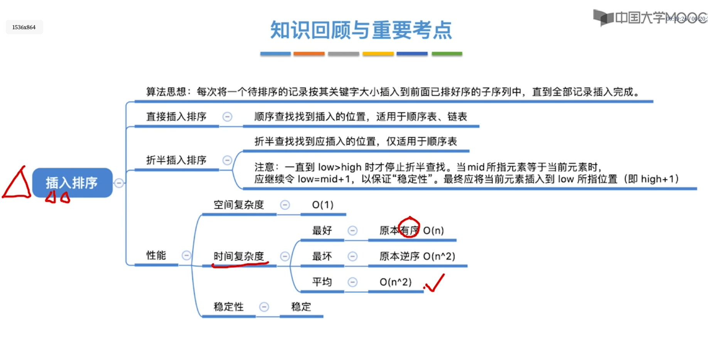
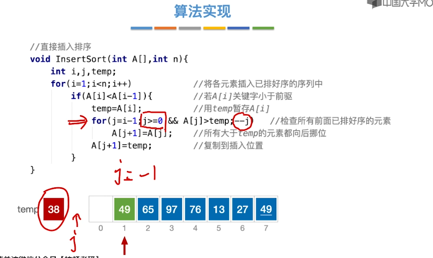
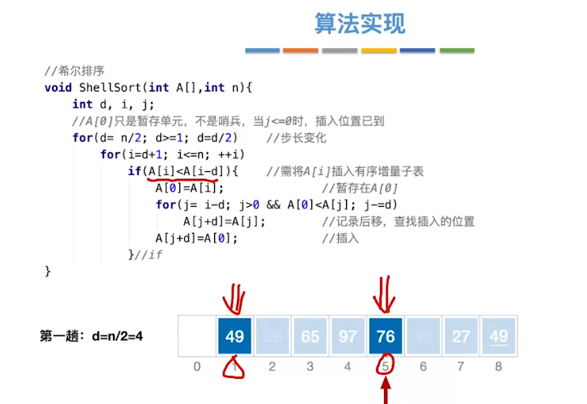
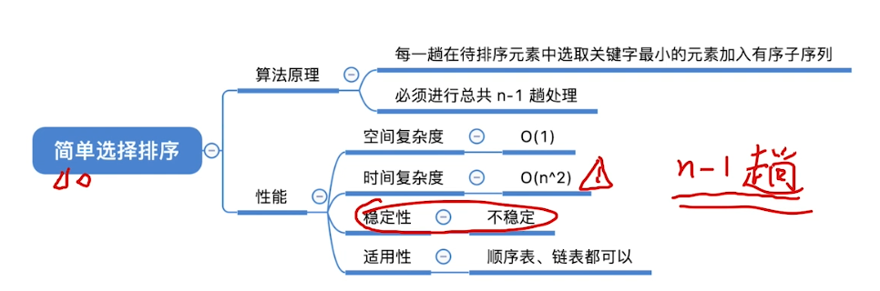
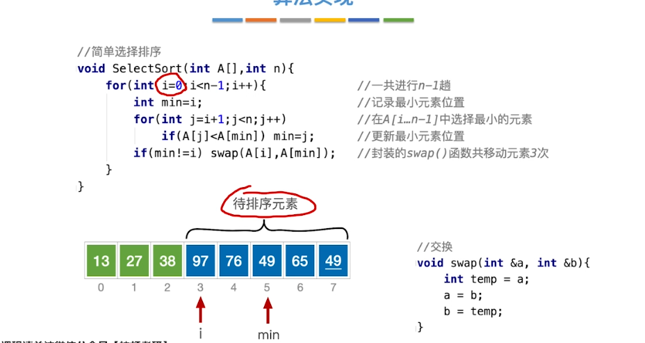

## 排序算法：
- 稳定性
    - 关键字相同的元素在排序之后相对位置是否会发生改变

- 分类：
    - 内部排序
        - 数据都在内存中
        - 关注算法时、空间复杂度更低
    - 外部排序
        - 数据太多，无法全部放入内存
        - 关注如何使读、写磁盘次数更少
可视化网站：
    https://www.cs.usfca.edu/~galles/visualization/ComparisonSort.html

## 插入排序：




## 希尔排序
- 算法流程：
    - 先将待排序表，分割成若干 形如L[i,i+d,i+2d,...,i+kd]的“特殊“子表,对各个子表分别进行直接插入排序。
    - 缩小增量d，重复上述过程，直到d=1
- 性能：
    - 空间复杂度：O(1)
    - 时间复杂度：未知，但是优于直接插入排序
    - 稳定性：不稳定
    - 适用性：仅可用于顺序表
- 高频题型：
    - 给出增量序列，分析每一趟排序后的状态
```c
//希尔排序
void ShellSort(int A[],int n){
int d, i, j;
//A[0]只是暂存单元，不是哨兵，当j<=0时，插入位置已到
for(d= n/2; d>=1; d=d/2)
    for(i=d+1; i<=n;++i)
        if(A[i]<A[i-d]){
            A[O]=A[i];
            for(j= i-d; j>0 && A[0]<A[j]; j-=d)
                A[j+d]=A[j];

            A[j+d]=A[0];
        }
```



## 简单选择排序：


